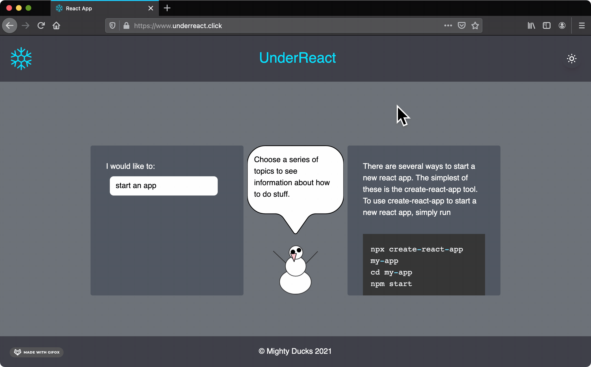
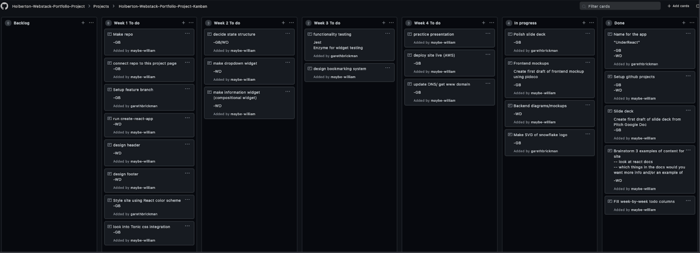

 

# UnderReact

## Description

A fast way to find the React essentials you need without digging through docs.

Utilizing a statement-based decision tree structure to find topics.

Providing real-world code examples, including from the app’s own codebase.

See a live deploy of the site right now at [underreact.click](https://www.underreact.click)!

## Example:

 

## Installation

Clone the project repo.

```bash
$ git clone https://github.com/garethbrickman/UnderReact.git
```

Install with **npm**:

```bash
$ npm install
```

## Usage

Start the app for development (by default at localhost:3000):

```bash
$ npm start
```

Build the app for production (enjoying the benefits of the included build optimization):

```bash
$ npm build
```

## Project Planning

[Github Projects](https://github.com/orgs/Holberton-Webstack-Portfolio-Project/projects/1)

 

## Authors

* William Dyrland-Marquis [@maybe-william](https://github.com/maybe-william) | [LinkedIn](https://www.linkedin.com/in/william-dyrland-marquis/)

Backend Engineering & Architecture - Melty Design & SVG Animation - Dropdown Functionality & Content Pane

* Gareth Brickman [@garethbrickman](https://github.com/garethbrickman) | [LinkedIn](https://www.linkedin.com/in/br1ck/)

Frontend Design & Syntax Highlighter - Dark Mode Toggle & Style Implementation - Build Optimization & AWS Deployment

## Licensing

Mozilla Public License Version 2.0
